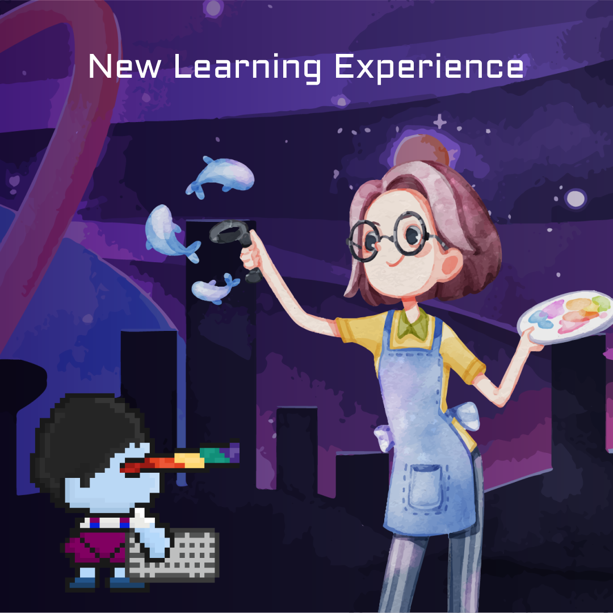

# For Creator


**Motto:** "Don‘t try so hard, the best things come when you least expect them to."


Creators can publish their teaching content. Each content will become NFT content. When other users watch and learn, the creator can get the token $DBT reward as their contribution reward. Other users can also support the creator by donating tokens $DBT or NFT avatars/objects/planets, etc. In addition, creators can also transfer or sell the NFT ownership of their creative content to others.

